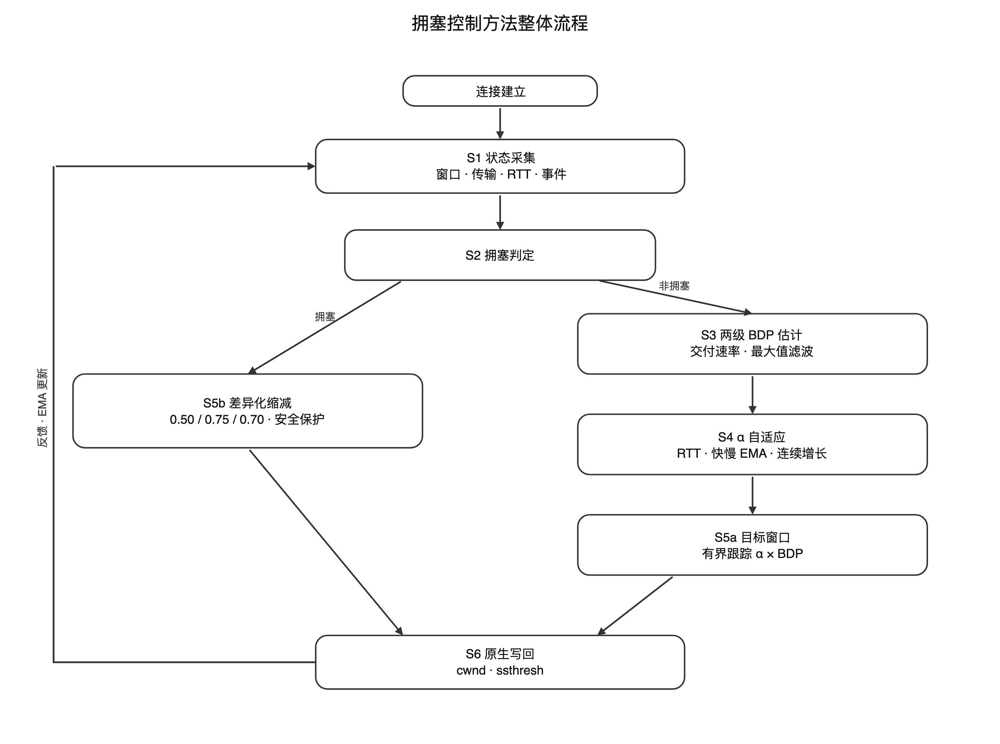
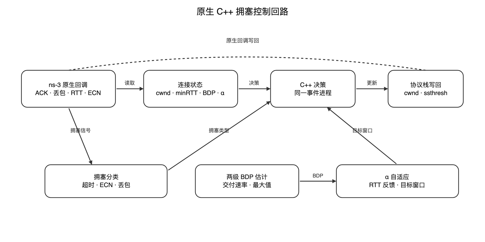
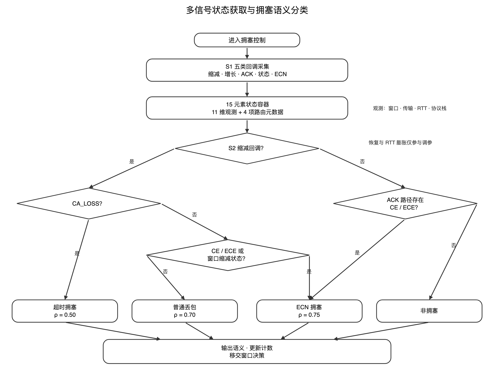
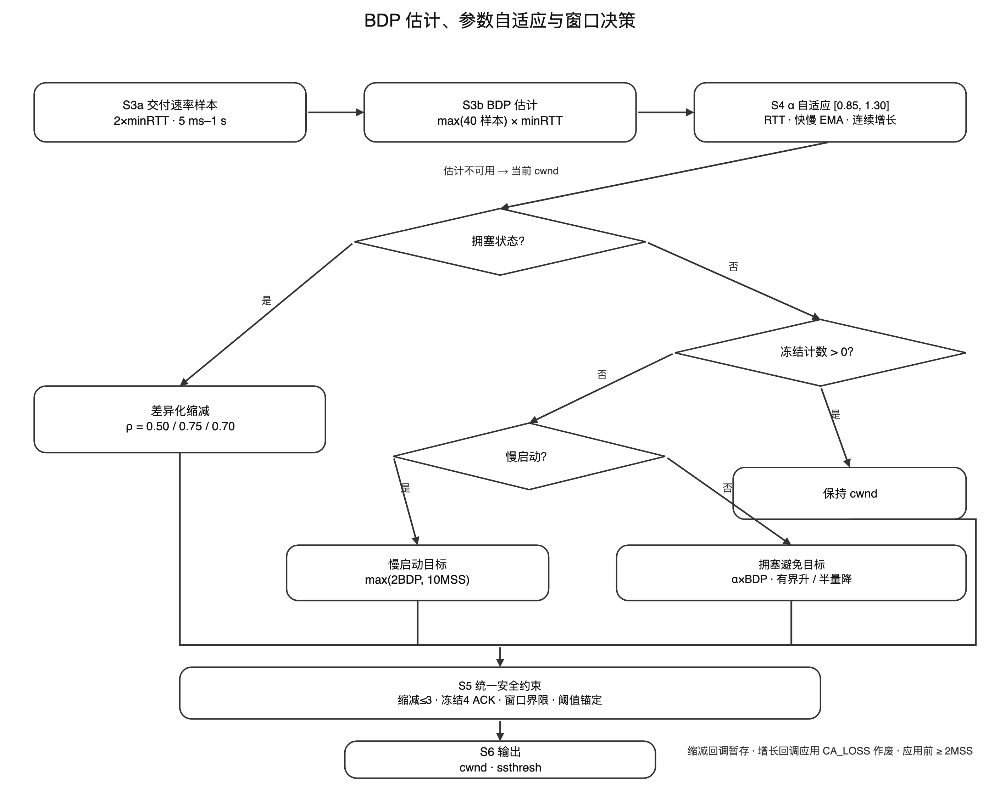
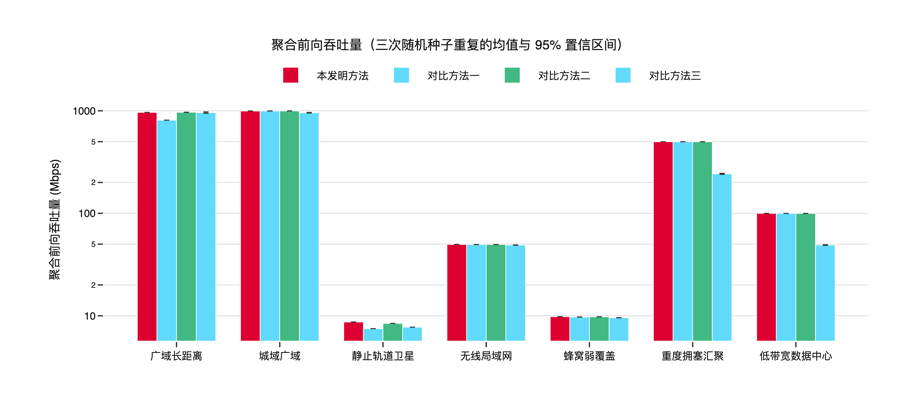
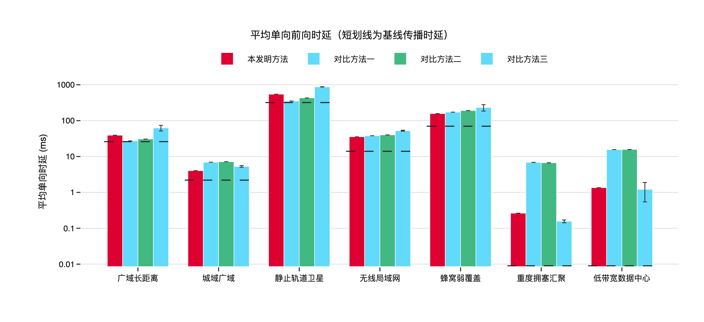

# 发明专利申请

---

## 一种多信号融合的启发式自适应网络拥塞控制方法及系统

---

### 技术领域

[0001] 本发明涉及计算机网络技术领域，特别涉及一种多信号融合的启发式自适应网络拥塞控制方法及系统，可应用于远距离传输、多种接入方式以及异构终端并存的端到端网络传输场景。

---

### 背景技术

[0002] 随着云计算、移动互联网、人工智能和物联网技术的快速发展，端到端网络传输场景正在从单一固定终端和近端高质量链路，扩展到跨地域远距离传输、蜂窝网络、无线局域网、卫星网络以及手机、笔记本电脑、台式机、边缘设备等多种终端并存的复杂环境。传输控制协议（Transmission Control Protocol，TCP）作为互联网传输层的核心协议，其拥塞控制机制直接影响网络资源利用效率、应用响应延迟和用户服务质量。在远距离路径、高带宽延迟积链路、无线链路抖动以及终端能力差异并存的场景下，拥塞控制算法面临更加复杂的信号感知和参数适配问题。

[0003] 在上述端到端传输环境中，拥塞信号的语义显著变得更加模糊。丢包既可能来自瓶颈队列真实溢出，也可能来自无线误码、链路切换或发送端调度抖动；往返时延（Round-Trip Time，RTT）升高既可能表示瓶颈排队，也可能来自路径变化、接入链路波动或对端处理延迟；终端后台同步、突发业务和多租户共享链路还会造成短时带宽挤占。依赖单一信号的拥塞控制方法难以在这些条件下稳定区分拥塞的成因与严重程度。

[0004] 现有TCP拥塞控制方法常见的技术路线包括基于丢包、基于时延以及基于带宽模型的控制。不同技术路线各有适用条件；在远距离传输、异构终端以及接入链路、路径往返时延和业务负载持续变化的端到端场景中，单一信号或固定参数难以兼顾链路利用与传输稳定性。

[0005] 基于丢包的拥塞控制算法（如TCP NewReno、TCP CUBIC、TCP Reno等）将数据包丢失作为主要拥塞信号，并按照既定规则增加或缩减拥塞窗口。此类算法实现较为简单，且与现有网络基础设施兼容，但在部分网络条件下存在以下局限：

[0006] 第一，丢包可能是滞后的拥塞信号。网络设备缓冲区在溢出丢包之前可能已经积累排队数据，使传输时延上升。

[0007] 第二，在高带宽延迟积（Bandwidth-Delay Product，BDP）链路上，窗口因丢包或超时回退后可能需要较长时间恢复。远距离传输、卫星链路、跨域广域网和高速无线接入均可能形成较大的带宽延迟积。

[0008] 第三，仅以丢包为主要依据时，对超时、普通丢包和显式拥塞通知所表达的不同事件语义利用不足，固定缩减方式可能与具体拥塞状态不匹配。

[0009] 基于时延的算法可通过监测RTT变化推断排队状态；基于带宽模型的算法还可估计瓶颈带宽与最小RTT，并据此确定发送窗口或发送速率。上述方法有助于在丢包前感知路径变化，但其适用效果仍受测量误差、参数设置和共存流量影响。

[0010] RTT测量可能受到操作系统调度、路径抖动、拓扑变化和对端处理等因素影响，因而RTT膨胀并不必然对应需要立即乘性降窗的拥塞事件。

[0011] 在不同拥塞控制范式共存时，基于时延的连接可能先于基于丢包的连接降低发送强度，从而在部分条件下出现带宽分配差异。

[0012] 部分方法采用固定阈值或固定步长，其参数难以同时适配终端类型、接入方式、路径RTT与业务条件的变化。

[0013] 此外，部分带宽估计实现若直接采用"单次确认所携带字节数除以一个完整RTT"计算速率，则在一个RTT内存在多个确认事件时可能低估交付速率，进而影响高带宽延迟积路径上的目标窗口计算。因此，需要以跨越多个确认事件的累计交付量和实际时间跨度构造速率样本。

[0014] 显式拥塞通知（Explicit Congestion Notification，ECN）机制允许网络设备在检测到拥塞趋势时设置拥塞经历（Congestion Experienced，CE）标记，接收端通过TCP报头的ECN-Echo（ECE）标志将该信息反馈给发送端。该机制可在不立即丢包的情况下提供显式拥塞信号。

[0015] 部分拥塞控制算法将ECN与丢包采用相同或相近的窗口响应。数据中心TCP（DCTCP）利用ECN标记比例进行调整，但其设计和参数主要面向数据中心网络；用于路径RTT、接入链路和终端条件差异较大的端到端传输时，仍需考虑参数适配与稳定性约束。

[0016] 针对单一信号与固定参数的局限，现有技术中也存在以显式规则或学习方式调节控制参数的方法。此类方法通常将网络状态量化为若干特征，再依据特征组合施加窗口或速率调整，其效果取决于状态表示与控制规则的设计。

[0017] 第一，部分方法仅使用窗口、时延与丢包统计，未同时利用显式拥塞通知状态、拥塞避免状态机状态和拥塞事件类型等协议栈内部信息，因而难以在超时、显式拥塞通知驱动的收缩与普通丢包之间实施有语义区分的响应。

[0018] 第二，部分参数自适应方法采用固定绝对阈值。当按确认事件生成的反馈值在正常确认处理时通常为正时，绝对阈值可能使控制参数持续向单一方向调整；固定阈值也难以适配差异较大的路径往返时延。

[0019] 第三，部分方法缺少针对连续降窗、降窗后快速反弹、窗口越界以及陈旧决策覆盖丢包恢复过程的约束，在链路条件波动或突发跨流量存在时可能出现窗口振荡或收缩过深。

[0020] 因此，需要一种新的技术方案：在协议栈回调点采集多维拥塞状态，对超时、显式拥塞通知和普通丢包进行语义分类；以滑动时间窗累计确认量估计带宽延迟积，并结合相对基线反馈进行确定性启发式窗口决策；同时设置降窗保护、冻结、窗口边界和陈旧决策作废机制，以适应远距离传输、异构终端以及多样接入与路径条件。

---

### 发明内容

[0021] 本发明的目的在于提供一种多信号融合的启发式自适应网络拥塞控制方法及系统，以解决现有技术中拥塞状态信息利用不足、带宽延迟积与控制参数难以适配路径变化，以及不确定拥塞信号下缺少稳定性保护等问题。

[0022] 本发明的技术构思集中于三项相互配合的技术手段：第一，多信号状态获取及超时、显式拥塞通知和普通丢包的语义分类；第二，基于滑动时间窗交付速率、最小往返时延和相对基线反馈的确定性启发式窗口决策；第三，面向连续降窗、降窗后反弹、窗口越界及陈旧决策的稳定性与安全约束。为实现上述技术构思，本发明第一方面提供一种应用于端到端网络传输发送端的拥塞控制方法，包括以下步骤：

[0023] S1、状态获取：在传输层协议栈的多个拥塞控制回调点采集拥塞状态信息，构成11维有效观测子空间，并将该有效观测子空间与用于跨模块路由的元数据一并承载于统一的状态传输容器中；

[0024] S2、拥塞判定：基于所述观测子空间中的回调类型标识、拥塞避免状态机状态与显式拥塞通知状态，在协议栈的窗口缩减回调内对拥塞事件进行三分类语义判定，分别判定为超时类拥塞、显式拥塞通知类拥塞或普通丢包类拥塞；在窗口增长回调内，当显式拥塞通知状态指示收到CE标记或ECE回显时判定为显式拥塞通知类拥塞；其余情况判定为非拥塞状态；

[0025] S3、带宽延迟积估计：分两级估计瓶颈链路的带宽延迟积，第一级根据最小往返时延的两倍确定滑动时间窗跨度，并将所述跨度限制在预设的时间下界与时间上界之间，再以时间窗内累计已确认字节数的增量计算交付速率样本；第二级对所述交付速率样本施加窗口化最大值滤波，并将滤波结果与最小往返时延相乘得到带宽延迟积估计值；

[0026] S4、参数自适应：为每个连接独立维护乘性增加因子，并依据往返时延膨胀比相对于最小往返时延感知阈值的判定结果、环境性能反馈值相对于其自身慢速基线的判定结果以及连续增长趋势三个因子在线调整所述乘性增加因子，并将其箝位于预设的下界与上界之间；

[0027] S5、窗口决策：在拥塞状态下按拥塞类型选取差异化窗口保留因子对拥塞窗口执行乘性缩减，将慢启动阈值锚定于当前拥塞窗口与带宽延迟积估计值中的较小者，并施加连续缩减保护与降窗后冻结；在非拥塞的拥塞避免阶段，以所述乘性增加因子与带宽延迟积估计值之积作为目标窗口，以有界步长向上逼近目标窗口或按超出量回落；最后将拥塞窗口箝位于预设的下界与上界之间；

[0028] S6、决策应用：将新的慢启动阈值与新的拥塞窗口作为动作输出并更新连接的传输控制参数；在只读的窗口缩减回调中无法直接写入拥塞窗口时，将拥塞窗口决策暂存并在后续可写的窗口增长回调中应用；当协议栈进入丢失状态时作废尚未应用的拥塞窗口决策。

[0029] 进一步地，所述步骤S1中，所述11维有效观测子空间包括：慢启动阈值、拥塞窗口、报文段大小、已确认报文段数量、在途字节数、最近往返时延、最小往返时延、回调类型标识、拥塞避免状态机状态、拥塞事件类型和显式拥塞通知状态；所述用于跨模块路由的元数据包括套接字标识符、环境类型标识、时刻信息和节点标识符共四项，与所述11维有效观测子空间共同构成15元素的状态传输容器。其中，所述回调类型标识用于区分该次观测由窗口缩减回调触发还是由窗口增长回调触发；所述拥塞避免状态机状态包括开放状态、无序状态、拥塞窗口缩减状态、恢复状态和丢失状态；所述拥塞事件类型包括传输开始、窗口重启、拥塞窗口缩减完成、丢包事件、无CE标记事件和有CE标记事件；所述显式拥塞通知状态包括禁用、空闲、收到CE标记、发送ECE、收到ECE和发送CWR。

[0030] 进一步地，所述步骤S1中的采集在下列回调点执行：窗口缩减回调，用于在协议栈请求新的慢启动阈值时采集状态并触发拥塞判定；窗口增长回调，用于在确认事件到达时采集状态并触发窗口增长决策；确认报文处理回调，用于更新最近往返时延与已确认报文段数量；拥塞状态设置回调，用于跟踪拥塞避免状态机状态的迁移；拥塞窗口事件回调，用于跟踪显式拥塞通知事件并维护拥塞标记检测标志。

[0031] 进一步地，所述步骤S2中的三分类语义判定按以下优先级执行：当窗口缩减回调被触发且拥塞避免状态机状态为丢失状态时，判定为超时类拥塞；否则，当显式拥塞通知状态为收到CE标记或收到ECE，或者拥塞避免状态机状态已进入拥塞窗口缩减状态时，判定为显式拥塞通知类拥塞；其余由窗口缩减回调触发的情况判定为普通丢包类拥塞。在窗口增长回调中观察到收到CE标记或收到ECE的状态时，该状态独立触发显式拥塞通知类响应。恢复状态和往返时延膨胀仅作为状态或参数调节依据，不独立触发乘性降窗。

[0032] 进一步地，所述步骤S5中的差异化窗口保留因子满足：超时类拥塞对应的保留因子小于普通丢包类拥塞对应的保留因子，普通丢包类拥塞对应的保留因子小于显式拥塞通知类拥塞对应的保留因子；缩减后的拥塞窗口不低于预设的窗口下界。作为优选，普通丢包类拥塞的保留因子取0.70，显式拥塞通知类拥塞的保留因子取0.75，超时类拥塞的保留因子取0.50。

[0033] 进一步地，所述步骤S3中的带宽延迟积估计具体包括：

维护累计已确认字节数，并在每次确认事件到达时记录由时刻与累计已确认字节数构成的样本；

将滑动时间窗的跨度取为最小往返时延的两倍，并将其箝位于预设的时间下界与时间上界之间，逐出早于该时间窗的样本；

以时间窗内累计已确认字节数的增量除以该时间窗的实际跨度，得到一个交付速率样本；

维护容量为预设长度的交付速率样本队列，取队列内最大值作为瓶颈带宽估计值；

维护往返时延采样队列并跟踪全局最小往返时延，所述全局最小往返时延取历史采样与协议栈提供的最小往返时延观测值中的最小者；

将瓶颈带宽估计值与所述全局最小往返时延相乘得到带宽延迟积估计值；当该估计值不可用时，以当前拥塞窗口作为保守回退值。

作为优选，所述时间下界为5毫秒，所述时间上界为1秒，所述交付速率样本队列的容量为40。

[0034] 进一步地，所述步骤S4中的三个因子具体包括：

因子一，路径感知的往返时延膨胀判定。以最小往返时延为依据构造松弛量，所述松弛量随最小往返时延的平方根增长；以该松弛量构造低、中、高三级动态阈值；当往返时延膨胀比低于低阈值时增大乘性增加因子并递增连续增长计数器，处于低阈值与中阈值之间时小幅增大乘性增加因子，高于高阈值时减小乘性增加因子并清零连续增长计数器。随最小往返时延增长的松弛量用于降低远距离长时延路径上的常规传播抖动触发过早抑制窗口的可能性。

因子二，相对基线的性能反馈判定。对环境性能反馈值序列同时维护快速指数移动平均与慢速基线指数移动平均，并由所述慢速基线的幅值构造自适应裕度；当快速指数移动平均高于慢速基线加上所述裕度时增大乘性增加因子，当快速指数移动平均低于慢速基线减去所述裕度的预设倍数时减小乘性增加因子。鉴于正常确认处理产生的性能反馈值通常为正，采用相对自身基线的变化量可避免仅由反馈值符号驱动参数持续向上界调整。

因子三，连续增长稳定性反馈。当连续增长计数器超过预设次数时，进一步小幅增大乘性增加因子。

作为优选，所述乘性增加因子的取值范围为$[0.85,1.30]$，初始值为1.10。

[0035] 进一步地，所述步骤S5中，非拥塞状态下的窗口决策包括：

在拥塞避免阶段，以乘性增加因子与带宽延迟积估计值之积作为目标窗口；

当前拥塞窗口低于目标窗口时，按有界步长向上逼近，所述有界步长取加性调节量、一个报文段大小以及当前窗口与目标窗口之差的预设分数三者中的最大值，且逼近结果不超过目标窗口与加性调节量之和；

当前拥塞窗口高于目标窗口时，按超出量的一半向下回落，且不低于目标窗口；

当前拥塞窗口与目标窗口相等时，按加性调节量执行保守增长；

慢启动阶段以带宽延迟积估计值的预设倍数与报文段大小的预设倍数中的较大者作为目标窗口，并在往返时延未出现明显膨胀且当前窗口显著低于带宽延迟积时采用加速增长；慢启动的退出判定采用随最小往返时延增大而放宽的往返时延膨胀容限，以降低远距离长时延路径过早退出慢启动的可能性。

[0036] 进一步地，所述步骤S5中的连续缩减保护与降窗后冻结包括：每次执行拥塞响应时递增连续缩减计数器并清零连续增长计数器；当连续缩减计数器超过预设的最大连续缩减次数时，保持当前拥塞窗口不再继续缩减；每次显式降窗后设置冻结计数器，在随后预设数量的确认事件内保持拥塞窗口不变；所述连续缩减计数器在冻结结束并进入非拥塞窗口调整分支时清零。作为优选，所述最大连续缩减次数为3，所述冻结的确认事件数量为4。

[0037] 进一步地，所述步骤S5中的慢启动阈值锚定包括：取当前拥塞窗口与带宽延迟积估计值中的较小者作为参考量，将该参考量与所述差异化窗口保留因子之积作为新的慢启动阈值，并使新的慢启动阈值不低于新的拥塞窗口且不低于预设的窗口下界。该处理使慢启动阈值同时受到当前窗口、带宽延迟积估计值和窗口下界的约束。

[0038] 进一步地，所述步骤S5中的窗口箝位包括：将新的拥塞窗口的下界取为四个最大报文段长度，将新的拥塞窗口的上界取为带宽延迟积估计值的四倍与二百个最大报文段长度中的较大者；新的慢启动阈值同样不低于所述下界。所述上下界用于限制窗口过度增长或过度收缩。

[0039] 进一步地，所述步骤S6中的决策应用包括：在只读的窗口缩减回调中，将拥塞窗口决策写入待应用缓冲并置位待应用标志；在后续的窗口增长回调中检测所述待应用标志，若已置位则将缓冲值应用于连接状态并复位标志；在拥塞状态设置回调中，当协议栈迁移至丢失状态时清除所述待应用标志并丢弃缓冲值，使超时重传前产生的陈旧窗口决策不会覆盖协议栈的丢包恢复过程。

[0040] 进一步地，所述方法还包括环境性能反馈值的生成：在确认事件对应的窗口增长回调中，所述性能反馈值由与已确认报文段数量成正比且设有上限的吞吐激励减去往返时延惩罚构成，所述往返时延惩罚仅在往返时延膨胀比超过预设阈值时生效并设有上限；在窗口缩减回调中，按拥塞类型施加分级负向反馈，显式拥塞通知类拥塞的惩罚幅度小于普通丢包类拥塞，普通丢包类拥塞的惩罚幅度小于超时类拥塞。

[0041] 进一步地，所述方法为每个连接以套接字标识符为键独立维护状态数据结构，所述状态数据结构包括交付速率样本队列与队列内最大带宽值、确认样本队列与累计已确认字节数、往返时延采样队列与全局最小往返时延、带宽延迟积估计值、乘性增加因子、连续缩减计数器、连续增长计数器、降窗后冻结计数器、累计丢包计数、累计显式拥塞通知计数以及慢启动阶段标识，从而在多连接并发时实现状态隔离与差异化控制。

[0042] 本发明第二方面提供一种拥塞控制系统，包括：状态采集模块，用于在传输层协议栈的多个拥塞控制回调点采集所述11维有效观测子空间并组织为状态传输容器，同时跟踪显式拥塞通知事件；决策模块，用于执行拥塞三分类语义判定、带宽延迟积两级估计、乘性增加因子在线自适应以及目标窗口与差异化缩减的计算，输出新的慢启动阈值与新的拥塞窗口；决策应用模块，用于将所述输出应用于连接的传输控制参数，实现延迟窗口应用与陈旧决策作废；通信模块，用于在所述状态采集模块与所述决策模块位于不同进程时按请求—应答方式同步传递状态传输容器与动作向量。

[0043] 进一步地，所述状态采集模块包括：观测空间定义单元，用于定义所述状态传输容器的元素数量、数据类型与取值范围；状态采集单元，用于在窗口缩减回调、窗口增长回调、确认报文处理回调、拥塞状态设置回调和拥塞窗口事件回调采集状态参数；显式拥塞通知事件处理单元，用于在拥塞窗口事件回调中根据有CE标记事件置位拥塞标记检测标志、根据无CE标记事件清除该标志，并在窗口缩减回调中消费该标志；延迟窗口应用单元，用于在只读回调中缓存拥塞窗口决策并在后续可写回调中应用；陈旧决策作废单元，用于在协议栈进入丢失状态时丢弃尚未应用的拥塞窗口决策。

[0044] 本发明第三方面提供一种计算机可读存储介质，其上存储有计算机程序，所述计算机程序被处理器执行时实现上述方法的步骤。

[0045] 本发明第四方面提供一种电子设备，包括处理器和存储器，所述存储器用于存储计算机程序，所述处理器执行所述计算机程序时实现上述方法的步骤。

[0046] 本发明的有益效果包括：

第一，通过在协议栈回调点联合获取窗口、确认、在途数据、往返时延、拥塞避免状态、拥塞事件与显式拥塞通知状态，并对超时、显式拥塞通知和普通丢包实施语义分类，本发明所述方法可减少仅依赖单一丢包或时延信号造成的响应滞后，并为差异化降窗提供状态依据。

第二，通过在受上下界约束的滑动时间窗内按累计确认字节增量计算交付速率，结合最小往返时延、窗口化最大值滤波、相对基线反馈和有界目标窗口跟踪形成确定性启发式决策，可降低单次确认样本对带宽延迟积估计的影响，并改善对远距离传输、异构终端以及多样接入和路径条件的适配能力。

第三，通过差异化窗口保留因子、连续缩减保护、降窗后冻结、慢启动阈值锚定、窗口上下界箝位以及陈旧待应用窗口作废等约束，可抑制不确定拥塞状态下的连续过度缩减、降窗后快速反弹和越界调整，有助于提高传输过程的稳定性与安全性。

上述有益效果在实施例五给出的仿真对比中得到部分验证；同时应当指出，在长时延路径的排队时延、多流并发时的流间公平性以及突发跨流量条件下的带宽再分配方面，仍有进一步改进的空间。

---

### 附图说明

[0047] 图1是本发明实施例提供的拥塞控制方法整体流程图；图2是本发明实施例提供的拥塞控制系统架构图；图3是本发明实施例提供的多信号状态获取与拥塞语义分类流程图；图4是本发明实施例提供的带宽延迟积估计、参数自适应与拥塞窗口决策流程图；图5是本发明实施例提供的纯传输控制协议设置下聚合前向吞吐量仿真对比图；图6是本发明实施例提供的平均单向前向时延仿真对比图；图7是本发明实施例提供的突发用户数据报协议负荷下跨流量鲁棒性仿真对比图。

---

### 具体实施方式

[0048] 为使本发明的目的、技术方案和优点更加清楚，下面结合附图和具体实施例对本发明作进一步详细描述。以下实施例用于说明本发明，而非限定本发明的保护范围。

#### 实施例一：拥塞控制方法

[0049] 如图1所示，本实施例提供一种拥塞控制方法，部署于端到端网络传输的发送端传输层拥塞控制模块，面向远距离传输、多种接入方式以及手机、笔记本电脑、台式机、边缘设备等异构终端类别所处的传输条件，包括如下步骤。上述终端名称用于说明预期端点类别；本实施例的网络配置对端点、接入链路、路径RTT与业务负载进行抽象，不表示已对相应物理设备逐一建模或验证。

[0050] 步骤S1：状态获取。如图3所示，在传输层协议栈的窗口缩减回调、窗口增长回调、确认报文处理回调、拥塞状态设置回调和拥塞窗口事件回调五个回调点采集拥塞状态信息，组装为15元素的状态传输容器。其中4个元素为跨模块路由的元数据，即套接字标识符、环境类型标识、时刻信息和节点标识符；其余11个元素构成有效观测子空间，依次为慢启动阈值、拥塞窗口、报文段大小、已确认报文段数量、在途字节数、最近往返时延、最小往返时延、回调类型标识、拥塞避免状态机状态、拥塞事件类型和显式拥塞通知状态。容器元素采用无符号整型表示并箝位于预设取值范围内，往返时延以微秒计。所述11维有效观测子空间可划分为四类：窗口状态类，包括慢启动阈值与拥塞窗口；传输指标类，包括报文段大小、已确认报文段数量与在途字节数；时延测量类，包括最近往返时延与最小往返时延；协议栈内部状态类，包括回调类型标识、拥塞避免状态机状态、拥塞事件类型与显式拥塞通知状态。协议栈内部状态类提供了对超时、显式拥塞通知和普通丢包进行语义分类所需的信息。

[0051] 步骤S2：拥塞判定。如图3的判定分支所示，当观测由窗口缩减回调触发时，按优先级执行三分类语义判定：若拥塞避免状态机状态为丢失状态，判定为超时类拥塞，并递增累计丢包计数；否则若显式拥塞通知状态为收到CE标记或收到ECE，或拥塞避免状态机状态已进入拥塞窗口缩减状态，判定为显式拥塞通知类拥塞，并递增累计显式拥塞通知计数；其余情况判定为普通丢包类拥塞，并递增累计丢包计数。当观测由窗口增长回调触发且显式拥塞通知状态为收到CE标记或收到ECE时，该状态独立触发显式拥塞通知类响应。其他情况判定为非拥塞状态。恢复状态与往返时延膨胀本身不独立触发乘性降窗；往返时延膨胀用于调节参数或慢启动退出判定。

[0052] 步骤S3：带宽延迟积估计。如图4上半部分所示，第一级，维护累计已确认字节数，每次确认事件到达时以当前时刻与累计已确认字节数构成样本入队；根据最小往返时延的两倍确定滑动时间窗跨度，并将其箝位于5毫秒至1秒之间，逐出早于该窗口的样本；以窗口内累计已确认字节数的增量除以窗口的实际时间跨度得到一个交付速率样本。该速率以跨越多个确认事件的累计交付量为依据，可降低单次确认载荷对带宽估计的影响。第二级，将交付速率样本送入容量为40的样本队列，取队列内最大值作为瓶颈带宽估计值；同时维护容量为40的往返时延采样队列，并将全局最小往返时延更新为历史采样与协议栈提供的最小往返时延观测值中的最小者；带宽延迟积估计值取瓶颈带宽估计值与全局最小往返时延之积。当该估计值不可用时，以当前拥塞窗口作为保守回退值。此外，可对交付速率维护指数移动平均以平滑吞吐观测。

[0053] 步骤S4：参数自适应。如图4中部所示，为每个连接独立维护乘性增加因子，初始值取1.10，取值范围箝位于$[0.85,1.30]$，并由三个因子叠加调整。因子一，以最小往返时延的毫秒值构造松弛量$s=0.3+0.15\times\sqrt{\max(0,\,RTT_{min,ms}-1)}$，据此构造低、中、高三级阈值$1+s$、$1+2s$与$1+4s$；令往返时延膨胀比为最近往返时延与全局最小往返时延之比，当膨胀比低于低阈值时增大乘性增加因子并递增连续增长计数器，处于低阈值与中阈值之间时小幅增大，高于高阈值时减小并清零连续增长计数器；长时延路径采用较小的上调步长与较大的下调步长。随最小往返时延增大的松弛量用于降低远距离路径常规传播抖动触发过早抑制窗口的可能性。因子二，对环境性能反馈值序列维护快速指数移动平均与慢速基线指数移动平均，快速平滑系数大于慢速平滑系数，并由慢速基线幅值构造自适应裕度；当快速平均高于基线加裕度时增大乘性增加因子，当快速平均低于基线减去裕度的预设倍数时减小乘性增加因子。因子三，当连续增长计数器超过预设次数时进一步小幅增大乘性增加因子。

[0054] 步骤S5：窗口决策。如图4下半部分所示，拥塞分支：按步骤S2的判定结果选取窗口保留因子，普通丢包类取0.70，显式拥塞通知类取0.75，超时类取0.50；新的拥塞窗口取保留因子与当前拥塞窗口之积，并不低于窗口下界；超时类拥塞时重新进入慢启动阶段。新的慢启动阈值以当前拥塞窗口与带宽延迟积估计值中的较小者为参考量，取该参考量与保留因子之积，并不低于新的拥塞窗口与窗口下界。每次拥塞响应递增连续缩减计数器、清零连续增长计数器并设置冻结计数器；当连续缩减计数器超过3时保持当前窗口不再缩减。非拥塞分支：若冻结计数器为正，则递减该计数器并保持窗口不变；否则清零连续缩减计数器并进入非拥塞窗口调整。慢启动阶段的目标窗口取带宽延迟积估计值的两倍与十个报文段大小中的较大者，标准增长量为已确认报文段数量与报文段大小之积，当前窗口显著低于带宽延迟积且最近往返时延未明显高于全局最小往返时延时采用双倍增长；慢启动退出判定采用随最小往返时延增大而放宽的往返时延膨胀容限。拥塞避免阶段的目标窗口取乘性增加因子与带宽延迟积估计值之积：当目标窗口高于当前窗口时，按加性调节量、一个报文段大小与差距的预设分数三者中的最大值向上逼近，且不超过目标窗口与加性调节量之和；当目标窗口低于当前窗口时，按超出量的一半向下回落且不低于目标窗口；当二者相等时按加性调节量保守增长。作为可选的补充，在最近往返时延未明显高于全局最小往返时延时，可根据在途字节数与拥塞窗口之比对利用率偏低的连接给予少量额外增长，并在长时延路径上削弱该额外增长。最后执行窗口箝位：下界取四个报文段大小，上界取带宽延迟积估计值的四倍与二百个报文段大小中的较大者；新的慢启动阈值不低于下界。

[0055] 步骤S6：决策应用。输出由新的慢启动阈值与新的拥塞窗口构成的动作向量并更新连接状态。由于窗口缩减回调接收只读的连接状态，无法直接写入拥塞窗口，因此在该回调中仅返回新的慢启动阈值，同时将新的拥塞窗口写入待应用缓冲并置位待应用标志；在后续窗口增长回调的起始处检测该标志，若已置位则将缓冲值写入连接状态并复位标志。在拥塞状态设置回调中，当协议栈迁移至丢失状态时清除待应用标志并丢弃缓冲值，避免超时重传前产生的陈旧窗口决策覆盖协议栈重置窗口后的丢包恢复过程。此外，在应用动作前对慢启动阈值与拥塞窗口施加不低于两个报文段大小的下限校验，以保证动作合法性。

#### 实施例二：拥塞控制系统与部署形态

[0056] 如图2所示，本实施例提供一种实现实施例一所述方法的拥塞控制系统，包括状态采集模块、决策模块、决策应用模块和通信模块。

[0057] 状态采集模块挂接于传输层协议栈的拥塞控制算子接口，在五个回调点采集状态并组装状态传输容器；其中拥塞窗口事件回调根据有CE标记事件置位拥塞标记检测标志、根据无CE标记事件清除该标志，窗口缩减回调消费并复位该标志，从而在跨回调之间保持显式拥塞通知语义的连续性。

[0058] 决策模块按规则化、确定性的方式执行拥塞三分类语义判定、带宽延迟积两级估计、乘性增加因子在线自适应以及目标窗口与差异化缩减的计算。所述启发式自适应构成"状态采集—决策输出—性能反馈"闭环，决策由可检查的显式规则产生，参数根据反馈值相对慢速基线的变化在线调整，不包含训练模型，也不执行神经网络推理。

[0059] 决策应用模块负责将动作应用于连接状态，并实现延迟窗口应用与陈旧决策作废。

[0060] 通信模块用于状态采集模块与决策模块分处不同进程时的同步交互：状态采集模块在回调处生成状态传输容器并发送，决策模块返回动作向量，状态采集模块接收动作后交由决策应用模块更新连接参数；所述请求—应答式同步交互使动作按照产生相应观测的协议栈事件顺序应用。

[0061] 决策模块以套接字标识符为键为每个连接维护独立状态，包括交付速率样本队列与队列内最大带宽值、确认样本队列与累计已确认字节数、往返时延采样队列与全局最小往返时延、带宽延迟积估计值、乘性增加因子、连续缩减计数器、连续增长计数器、降窗后冻结计数器、累计丢包计数、累计显式拥塞通知计数以及慢启动阶段标识，从而在多连接并发时实现状态隔离。

#### 实施例三：环境性能反馈值的生成

[0062] 本实施例说明供步骤S4因子二使用的环境性能反馈值（以下简称反馈值）生成方式，采用分场景差异化设计。

[0063] 在确认事件对应的窗口增长回调中，反馈值由吞吐激励减去往返时延惩罚构成：吞吐激励与已确认报文段数量成正比并设有上限，以抑制突发确认造成的反馈噪声；往返时延惩罚仅在往返时延膨胀比超过预设阈值（本实施例取1.5）时生效，其幅度与超出量成正比并设有上限，从而在给予排队一定容限的同时温和抑制时延膨胀。

[0064] 在窗口缩减回调中按拥塞类型施加分级负向反馈：显式拥塞通知类拥塞对应最小惩罚幅度，普通丢包类拥塞对应中等惩罚幅度，超时类拥塞对应最大惩罚幅度。该分级使显式拥塞通知、普通丢包与超时获得不同的反馈权重。

[0065] 在正常确认处理产生的反馈值通常为正的情况下，步骤S4因子二不以反馈值的正负或固定绝对阈值直接判断控制效果，而是以快速指数移动平均与慢速基线指数移动平均之差配合自适应裕度进行判定，以避免参数仅因反馈值符号而持续向上界调整。

#### 实施例四：适用场景与技术效果

[0066] 本发明所述方法面向广泛的端到端网络传输场景，包括远距离广域互联、无线局域网接入、蜂窝移动接入、卫星链路以及手机、笔记本电脑、台式机与其他端点类别所处的传输条件。所述适用场景允许端点能力、接入链路、路径RTT和业务负载存在差异；其中终端类别表示预期应用条件，不表示对物理终端作了逐类验证。

[0067] 对于第一项核心技术手段，所述方法联合使用回调类型、拥塞避免状态、拥塞事件和显式拥塞通知状态，将可观测拥塞事件划分为超时、显式拥塞通知和普通丢包，并采用不同的窗口保留因子。该分类不声称识别普通丢包的物理成因，而是为不同协议栈事件提供分级响应依据；其中，窗口增长回调中观察到的CE或ECE状态可直接触发显式拥塞通知类响应。

[0068] 对于第二项核心技术手段，所述方法以滑动时间窗内累计确认字节的增量形成交付速率样本，以窗口化最大值与最小往返时延形成带宽延迟积估计，并依据最小往返时延感知阈值和相对基线反馈调整目标窗口。该确定性启发式处理可降低单次确认事件与固定绝对阈值对决策的影响，有助于适配长往返时延、不同接入链路和变化业务条件。

[0069] 对于第三项核心技术手段，所述方法通过差异化窗口保留、连续缩减保护、降窗后冻结、慢启动阈值锚定、窗口上下界及陈旧待应用窗口作废限制控制动作。在拥塞信号密集、RTT波动或突发跨流量条件下，上述约束用于降低连续过度降窗、降窗后快速反弹及陈旧动作干扰丢包恢复的可能性。

[0070] 本实施例所述技术效果来源于三项核心技术手段的组合，不将某一单独规则的效果表述为已被独立验证的因果结论。具体参数可依据端点能力、链路带宽、传播时延、队列配置和业务负载进行设定。

[0071] 当往返时延膨胀持续升高时，参数自适应规则降低窗口扩张倾向；当连续拥塞事件出现时，连续缩减保护限制进一步收缩；当降窗刚发生时，冻结计数器在预设数量的确认事件内保持窗口不变。上述处理用于在不确定路径条件下约束控制动作幅度。

[0072] 凡采用本发明所述三项核心技术手段，即多信号状态获取与语义分类、确定性启发式融合决策以及窗口稳定性与安全约束，并作出等同替换或组合的，均应落入本发明的保护范围。

#### 实施例五：仿真验证与结果分析

[0073] 本实施例给出本发明所述方法在离散事件网络仿真平台（ns-3.40）上的对比实验结果，用于说明前述三项核心技术手段在远距离传输、异构接入与多样路径条件下的作用。实验结果取自同一拓扑与同一参数配置，不构成对未测试网络条件的普遍性结论。

[0074] 仿真配置。采用哑铃型拓扑：三对端点分别经接入链路连接至两台路由器，两台路由器之间为共享瓶颈链路；三条前向传输控制协议数据流分别于0.1秒、0.2秒与0.3秒启动，持续发送至20.1秒，仿真运行至21.1秒以排空在途报文；报文段长度1500字节，发送与接收缓冲区均为16兆字节，启用选择确认与延迟确认，并对全部被比较方法启用显式拥塞通知；瓶颈链路与接入链路采用随机早期检测队列，队列容量取三倍带宽延迟积与100个报文中的较大者，标记阈值取队列容量的30%至90%。表1给出七组场景的链路参数，其中基线单向时延为两倍接入时延与瓶颈时延之和，即不排队条件下单向前向时延的下界。上述场景覆盖远距离广域、城域广域、卫星长时延、无线局域网接入、蜂窝弱覆盖接入以及两种数据中心拥塞梯度等类别。

表1场景链路参数

| 场景           | 接入带宽 | 瓶颈带宽 | 接入时延 | 瓶颈时延 | 基线单向时延 |
| -------------- | -------- | -------- | -------- | -------- | ------------ |
| 广域长距离     | 10Gbps   | 1Gbps    | 0.5ms    | 25ms     | 26ms         |
| 城域广域       | 10Gbps   | 1Gbps    | 0.1ms    | 2ms      | 2.2ms        |
| 静止轨道卫星   | 50Mbps   | 10Mbps   | 10ms     | 300ms    | 320ms        |
| 无线局域网接入 | 100Mbps  | 50Mbps   | 2ms      | 10ms     | 14ms         |
| 蜂窝弱覆盖接入 | 50Mbps   | 10Mbps   | 10ms     | 50ms     | 70ms         |
| 重度拥塞汇聚   | 10Gbps   | 500Mbps  | 2μs      | 5μs      | 9μs          |
| 低带宽数据中心 | 1Gbps    | 100Mbps  | 2μs      | 5μs      | 9μs          |

[0075] 对比方法。本发明方法按实施例一所述步骤实施；对比方法一为经典丢包型拥塞控制方法，对比方法二为面向高带宽延迟积链路的丢包型方法，对比方法三为基于带宽模型的方法。三者在同一拓扑、同一队列配置与同一显式拥塞通知设置下运行。每组配置以RngRun42、43、44重复三次，表中数值为三次运行的均值。需要说明的是，在未启用随机丢包的确定性配置下，本发明方法与对比方法一、对比方法二的三次运行结果一致，因而其置信区间为零；对比方法三因内部随机化存在小幅波动。

[0076] 纯传输控制协议设置下的结果。表2给出七组场景的聚合前向吞吐量，表3给出相应的平均单向前向时延，图5与图6分别为其图示。

表2聚合前向吞吐量（Mbps）

| 场景           | 本发明方法 | 对比方法一 | 对比方法二 | 对比方法三 |
| -------------- | ---------- | ---------- | ---------- | ---------- |
| 广域长距离     | 963.6      | 811.3      | 968.0      | 961.4      |
| 城域广域       | 996.0      | 996.6      | 997.2      | 957.7      |
| 静止轨道卫星   | 8.70       | 7.50       | 8.43       | 7.75       |
| 无线局域网接入 | 49.7       | 49.6       | 49.6       | 49.0       |
| 蜂窝弱覆盖接入 | 9.80       | 9.73       | 9.77       | 9.59       |
| 重度拥塞汇聚   | 499.3      | 499.3      | 499.3      | 242.8      |
| 低带宽数据中心 | 99.9       | 99.9       | 99.9       | 49.1       |

表3平均单向前向时延（ms）

| 场景           | 本发明方法 | 对比方法一 | 对比方法二 | 对比方法三 |
| -------------- | ---------- | ---------- | ---------- | ---------- |
| 广域长距离     | 39.21      | 27.29      | 30.68      | 62.79      |
| 城域广域       | 4.033      | 6.953      | 7.174      | 5.307      |
| 静止轨道卫星   | 546.9      | 352.0      | 429.4      | 875.4      |
| 无线局域网接入 | 35.47      | 37.99      | 40.11      | 52.56      |
| 蜂窝弱覆盖接入 | 157.2      | 173.0      | 191.0      | 232.3      |
| 重度拥塞汇聚   | 0.264      | 6.891      | 6.676      | 0.157      |
| 低带宽数据中心 | 1.354      | 15.63      | 15.74      | 1.218      |

[0077] 由表2与表3可见如下三方面结果。

第一，在远距离与大时延场景中，本发明方法的吞吐量达到最高或与最优对比方法相当。静止轨道卫星场景中本发明方法的瓶颈利用率为87.0%，高于对比方法一的75.0%、对比方法二的84.3%与对比方法三的77.5%；蜂窝弱覆盖接入场景中利用率达到98.0%，高于三种对比方法的97.3%、97.7%与95.9%；城域广域与无线局域网接入场景中利用率分别为99.6%与99.3%，与两种丢包型对比方法相当。在七组纯传输控制协议场景中，本发明方法的丢包率均为零。

第二，在达到相同瓶颈利用率时，本发明方法的平均单向时延低于两种丢包型对比方法。在重度拥塞汇聚与低带宽数据中心场景中，本发明方法与两种丢包型对比方法均达到99.9%的瓶颈利用率，而本发明方法的平均单向时延分别为0.264ms与1.354ms，对比方法一为6.891ms与15.63ms，对比方法二为6.676ms与15.74ms；在城域广域场景中，本发明方法在利用率相当（99.6%对99.7%）的条件下平均单向时延为4.033ms，低于对比方法一的6.953ms与对比方法二的7.174ms。该结果表明，以滑动时间窗交付速率与最小往返时延形成的带宽延迟积估计、配合乘性增加因子自适应的目标窗口跟踪，有助于在维持链路利用率的同时抑制排队时延。对比方法三在上述两个数据中心场景中平均单向时延更低（0.157ms与1.218ms），但其瓶颈利用率仅为48.6%与49.1%，且出现约一半的带宽未被利用的情况。

第三，存在应当如实说明的混合结果与局限。在广域长距离与静止轨道卫星场景中，本发明方法的平均单向时延（39.21ms与546.9ms）高于对比方法一（27.29ms与352.0ms）与对比方法二（30.68ms与429.4ms），即本发明方法以部分排队时延换取更高的链路利用率与零丢包；在无线局域网接入场景中，本发明方法的Jain公平性指数为0.602，低于对比方法一的0.998、对比方法二的0.999与对比方法三的1.000，蜂窝弱覆盖接入场景中为0.923，亦略低于三种对比方法，说明多流并发条件下的流间公平性存在退化，可作为后续改进方向。

[0078] 突发跨流量条件下的鲁棒性。表4与图7给出在共享瓶颈上叠加突发用户数据报协议负荷（平均占用瓶颈带宽32%、峰值64%、占空比50%、报文长度1024字节）后，各方法聚合前向吞吐量相对纯传输控制协议设置的保有率与新增丢包。

表4突发用户数据报协议负荷下的吞吐量保有率与新增丢包

| 场景           | 本发明方法    | 对比方法一    | 对比方法二    | 对比方法三    |
| -------------- | ------------- | ------------- | ------------- | ------------- |
| 广域长距离     | 76.4%（0.00） | 73.8%（0.18） | 74.5%（0.08） | 76.7%（1.60） |
| 城域广域       | 77.9%（0.00） | 80.2%（0.00） | 80.3%（0.00） | 74.7%（0.00） |
| 静止轨道卫星   | 75.8%（0.00） | 61.2%（0.00） | 62.5%（0.00） | 78.3%（0.00） |
| 无线局域网接入 | 68.8%（0.00） | 72.3%（0.00） | 75.5%（0.00） | 77.5%（0.00） |
| 蜂窝弱覆盖接入 | 71.3%（0.00） | 71.6%（0.00） | 73.6%（0.00） | 77.6%（0.00） |
| 重度拥塞汇聚   | 69.6%（0.00） | 76.8%（0.00） | 76.8%（0.00） | 10.9%（0.00） |
| 低带宽数据中心 | 69.9%（0.00） | 75.0%（0.00） | 76.1%（0.00） | 12.4%（0.00） |

注：括号内为相对纯传输控制协议设置的新增丢包，单位为百分点。

[0079] 由表4可见：在广域长距离场景中，本发明方法在突发负荷下未产生新增丢包，而对比方法一、对比方法二与对比方法三分别新增0.18、0.08与1.60个百分点，且对比方法三的吞吐量在三次重复间出现较大波动；在静止轨道卫星场景中，本发明方法的吞吐量保有率为75.8%，高于对比方法一的61.2%与对比方法二的62.5%。同时应当指出，在重度拥塞汇聚、低带宽数据中心与无线局域网接入场景中，本发明方法的吞吐量保有率（69.6%、69.9%、68.8%）低于对比方法二（76.8%、76.1%、75.5%），表明突发跨流量条件下的带宽再分配与公平性仍有改进空间；对比方法三在上述两个数据中心场景中的吞吐量保有率仅为10.9%与12.4%。

[0080] 综上，上述仿真结果表明：多信号状态获取与语义分类、以带宽延迟积估计为核心的确定性启发式窗口决策、以及连续缩减保护、降窗后冻结、窗口上下界与陈旧决策作废等稳定性与安全约束的组合，有助于在远距离传输、异构接入与多样路径条件下兼顾链路利用率、传输时延与丢包控制，并在突发跨流量条件下避免新增丢包；同时，长时延场景的排队时延、多流并发时的公平性以及突发跨流量下的带宽再分配仍存在改进空间。上述数值均为特定拓扑与参数下的仿真结果，用于说明技术效果，不用于限定本发明的保护范围。

---

### 权利要求书

1.一种拥塞控制方法，应用于端到端网络传输的发送端，其特征在于，包括以下步骤：

S1、在传输层协议栈的多个拥塞控制回调点采集拥塞状态信息，构成11维有效观测子空间，所述11维有效观测子空间包括慢启动阈值、拥塞窗口、报文段大小、已确认报文段数量、在途字节数、最近往返时延、最小往返时延、回调类型标识、拥塞避免状态机状态、拥塞事件类型和显式拥塞通知状态；

S2、基于所述回调类型标识、所述拥塞避免状态机状态和所述显式拥塞通知状态，在协议栈的窗口缩减回调内对拥塞事件进行三分类语义判定，分别判定为超时类拥塞、显式拥塞通知类拥塞或普通丢包类拥塞；在窗口增长回调内，当所述显式拥塞通知状态指示收到CE标记或ECE回显时，判定为显式拥塞通知类拥塞；其余情况判定为非拥塞状态；

S3、分两级估计带宽延迟积，第一级根据最小往返时延的两倍确定滑动时间窗跨度，将所述跨度限制在预设的时间下界与时间上界之间，并以时间窗内累计已确认字节数的增量除以实际跨度得到交付速率样本；第二级对所述交付速率样本施加窗口化最大值滤波并将滤波结果与最小往返时延相乘，得到带宽延迟积估计值；

S4、为每个连接独立维护乘性增加因子，依据往返时延膨胀比相对于最小往返时延感知阈值的判定结果、环境性能反馈值相对于其自身慢速基线的判定结果以及连续增长趋势三个因子在线调整所述乘性增加因子，并将其箝位于预设的下界与上界之间；

S5、在拥塞状态下按拥塞类型选取差异化窗口保留因子对拥塞窗口执行乘性缩减，并施加连续缩减保护与降窗后冻结；在非拥塞的拥塞避免阶段，以所述乘性增加因子与所述带宽延迟积估计值之积作为目标窗口，以有界步长向上逼近所述目标窗口或按超出量向下回落；

S6、将新的慢启动阈值与新的拥塞窗口作为动作输出并更新连接的传输控制参数；

其中，步骤S1至S2构成多信号状态获取与语义分类，步骤S3至S5构成确定性启发式融合决策，步骤S5至S6还包括窗口稳定性与安全约束。

2.根据权利要求1所述的拥塞控制方法，其特征在于，所述步骤S1中，所述11维有效观测子空间与四项用于跨模块路由的元数据共同构成15元素的状态传输容器，所述四项元数据为套接字标识符、环境类型标识、时刻信息和节点标识符；

所述采集在窗口缩减回调、窗口增长回调、确认报文处理回调、拥塞状态设置回调和拥塞窗口事件回调执行；

所述拥塞避免状态机状态包括开放状态、无序状态、拥塞窗口缩减状态、恢复状态和丢失状态，所述显式拥塞通知状态包括禁用、空闲、收到CE标记、发送ECE、收到ECE和发送CWR。

3.根据权利要求1所述的拥塞控制方法，其特征在于，所述步骤S2中的三分类语义判定按以下优先级执行：

当窗口缩减回调被触发且所述拥塞避免状态机状态为丢失状态时，判定为超时类拥塞；

否则，当所述显式拥塞通知状态为收到CE标记或收到ECE，或者所述拥塞避免状态机状态已进入拥塞窗口缩减状态时，判定为显式拥塞通知类拥塞；

其余由窗口缩减回调触发的情况判定为普通丢包类拥塞；

在窗口增长回调中，收到CE标记或收到ECE的状态独立触发显式拥塞通知类响应；恢复状态和往返时延膨胀不独立触发乘性降窗。

4.根据权利要求1或3所述的拥塞控制方法，其特征在于，所述差异化窗口保留因子满足：超时类拥塞对应的保留因子小于普通丢包类拥塞对应的保留因子，普通丢包类拥塞对应的保留因子小于显式拥塞通知类拥塞对应的保留因子；缩减后的拥塞窗口不低于预设的窗口下界。

5.根据权利要求4所述的拥塞控制方法，其特征在于，普通丢包类拥塞对应的保留因子为0.70，显式拥塞通知类拥塞对应的保留因子为0.75，超时类拥塞对应的保留因子为0.50。

6.根据权利要求1所述的拥塞控制方法，其特征在于，所述步骤S3具体包括：

维护累计已确认字节数，并在每次确认事件到达时记录由时刻与累计已确认字节数构成的样本；

将所述滑动时间窗的跨度取为最小往返时延的两倍并箝位于预设的时间下界与时间上界之间，逐出早于该时间窗的样本；

维护容量为预设长度的交付速率样本队列，取该队列内的最大值作为瓶颈带宽估计值；

维护往返时延采样队列并将全局最小往返时延更新为历史采样与协议栈提供的最小往返时延观测值中的最小者；

将所述瓶颈带宽估计值与所述全局最小往返时延相乘得到所述带宽延迟积估计值，当该估计值不可用时以当前拥塞窗口作为保守回退值。

7.根据权利要求6所述的拥塞控制方法，其特征在于，所述时间下界为5毫秒，所述时间上界为1秒，所述交付速率样本队列的容量为40。

8.根据权利要求1所述的拥塞控制方法，其特征在于，所述步骤S4中：

所述往返时延膨胀比的判定采用随最小往返时延的平方根增长的松弛量构造低、中、高三级动态阈值，膨胀比低于低阈值时增大所述乘性增加因子并递增连续增长计数器，处于低阈值与中阈值之间时小幅增大所述乘性增加因子，高于高阈值时减小所述乘性增加因子并清零连续增长计数器；

所述环境性能反馈值的判定对反馈值序列同时维护快速指数移动平均与慢速基线指数移动平均，并由所述慢速基线的幅值构造自适应裕度，当所述快速指数移动平均高于所述慢速基线与所述自适应裕度之和时增大所述乘性增加因子，当所述快速指数移动平均低于所述慢速基线减去所述自适应裕度的预设倍数时减小所述乘性增加因子；

所述连续增长趋势的判定在所述连续增长计数器超过预设次数时进一步增大所述乘性增加因子。

9.根据权利要求8所述的拥塞控制方法，其特征在于，所述乘性增加因子的取值范围为0.85至1.30，初始值为1.10。

10.根据权利要求1所述的拥塞控制方法，其特征在于，所述步骤S5中非拥塞状态下的窗口决策包括：

当前拥塞窗口低于所述目标窗口时，按加性调节量、一个报文段大小以及当前拥塞窗口与所述目标窗口之差的预设分数三者中的最大值向上逼近，且逼近结果不超过所述目标窗口与所述加性调节量之和；

当前拥塞窗口高于所述目标窗口时，按超出量的一半向下回落且不低于所述目标窗口；

当前拥塞窗口与所述目标窗口相等时，按所述加性调节量执行保守增长；

慢启动阶段以所述带宽延迟积估计值的预设倍数与报文段大小的预设倍数中的较大者作为目标窗口，且慢启动的退出判定所采用的往返时延膨胀容限随最小往返时延的增大而放宽。

11.根据权利要求1所述的拥塞控制方法，其特征在于，所述步骤S5中的连续缩减保护与降窗后冻结包括：

每次执行拥塞响应时递增连续缩减计数器并清零连续增长计数器；

当所述连续缩减计数器超过预设的最大连续缩减次数时，保持当前拥塞窗口不再继续缩减；

每次显式降窗后设置冻结计数器，在随后预设数量的确认事件内保持拥塞窗口不变；

所述连续缩减计数器在冻结结束并进入非拥塞窗口调整分支时清零。

12.根据权利要求1所述的拥塞控制方法，其特征在于，所述步骤S5还包括慢启动阈值锚定：取当前拥塞窗口与所述带宽延迟积估计值中的较小者作为参考量，将该参考量与所述差异化窗口保留因子之积作为新的慢启动阈值，并使新的慢启动阈值不低于新的拥塞窗口，从而使所述慢启动阈值同时受到当前拥塞窗口和所述带宽延迟积估计值的约束。

13.根据权利要求1所述的拥塞控制方法，其特征在于，所述步骤S5还包括窗口箝位：将新的拥塞窗口的下界取为四个最大报文段长度，将新的拥塞窗口的上界取为所述带宽延迟积估计值的四倍与二百个最大报文段长度中的较大者，并将新的慢启动阈值同样箝位于不低于所述下界。

14.根据权利要求1所述的拥塞控制方法，其特征在于，所述步骤S6包括：

在只读的窗口缩减回调中将拥塞窗口决策写入待应用缓冲并置位待应用标志，仅返回新的慢启动阈值；

在后续的窗口增长回调中检测所述待应用标志，若已置位则将所述待应用缓冲中的值应用于连接状态并复位所述待应用标志；

在拥塞状态设置回调中，当协议栈迁移至丢失状态时清除所述待应用标志并丢弃所述待应用缓冲中的值，使所述拥塞窗口决策不覆盖协议栈的丢包恢复过程。

15.根据权利要求1所述的拥塞控制方法，其特征在于，还包括生成所述环境性能反馈值：

在确认事件对应的窗口增长回调中，所述环境性能反馈值由与已确认报文段数量成正比且设有上限的吞吐激励减去往返时延惩罚构成，所述往返时延惩罚仅在往返时延膨胀比超过预设阈值时生效且设有上限；

在窗口缩减回调中按拥塞类型施加分级负向反馈，显式拥塞通知类拥塞的惩罚幅度小于普通丢包类拥塞的惩罚幅度，普通丢包类拥塞的惩罚幅度小于超时类拥塞的惩罚幅度。

16.一种拥塞控制系统，其特征在于，包括：

状态采集模块，用于在传输层协议栈的多个拥塞控制回调点采集权利要求1所述的11维有效观测子空间并组织为状态传输容器，以及跟踪显式拥塞通知事件；

决策模块，用于执行权利要求1所述的三分类语义判定、两级带宽延迟积估计、乘性增加因子在线自适应以及目标窗口与差异化缩减的计算，输出新的慢启动阈值与新的拥塞窗口；

决策应用模块，用于将所述新的慢启动阈值与所述新的拥塞窗口应用于连接的传输控制参数，并实现延迟窗口应用与陈旧决策作废；

通信模块，用于在所述状态采集模块与所述决策模块位于不同进程时按请求—应答方式同步传递所述状态传输容器与动作向量。

17.根据权利要求16所述的拥塞控制系统，其特征在于，所述状态采集模块包括：

观测空间定义单元，用于定义所述状态传输容器的元素数量、数据类型与取值范围；

状态采集单元，用于在窗口缩减回调、窗口增长回调、确认报文处理回调、拥塞状态设置回调和拥塞窗口事件回调采集状态参数；

显式拥塞通知事件处理单元，用于根据有CE标记事件置位拥塞标记检测标志、根据无CE标记事件清除所述拥塞标记检测标志，并在窗口缩减回调中消费所述拥塞标记检测标志；

延迟窗口应用单元，用于在只读回调中缓存拥塞窗口决策并在后续可写回调中应用所述拥塞窗口决策；

陈旧决策作废单元，用于在协议栈进入丢失状态时丢弃尚未应用的拥塞窗口决策。

18.一种计算机可读存储介质，其上存储有计算机程序，其特征在于，所述计算机程序被处理器执行时实现权利要求1至15中任一项所述的拥塞控制方法的步骤。

19.一种电子设备，其特征在于，包括处理器和存储器，所述存储器用于存储计算机程序，所述处理器执行所述计算机程序时实现权利要求1至15中任一项所述的拥塞控制方法的步骤。

---

### 说明书摘要

本发明公开了一种多信号融合的启发式自适应网络拥塞控制方法及系统。该方法包括三项相互配合的技术手段：其一，在传输层协议栈的多个回调点采集包含窗口、确认、在途数据、往返时延、拥塞避免状态、拥塞事件和显式拥塞通知状态的观测信息，对超时、显式拥塞通知和普通丢包进行语义分类，其中窗口增长回调中观察到的CE或ECE状态可触发显式拥塞通知类响应；其二，根据两倍最小往返时延确定并按预设上下界限制滑动时间窗，以累计确认字节增量计算交付速率，经窗口化最大值滤波得到带宽估计，并结合最小往返时延感知阈值、相对基线反馈和有界目标窗口跟踪形成确定性启发式决策；其三，通过差异化窗口保留、连续缩减保护、降窗后冻结、慢启动阈值锚定、窗口上下界及陈旧决策作废限制控制动作。本发明适用于远距离传输、手机、笔记本电脑、台式机及其他异构终端类别，以及端点、接入链路、路径RTT和业务负载存在差异的端到端传输条件。

### 摘要附图

图1本发明所述拥塞控制方法整体流程图（指定为摘要附图）。

---

### 说明书附图

图2.拥塞控制方法整体流程图。

图3.拥塞控制系统架构图。

图4.多信号状态获取与拥塞语义分类流程图。

图5.带宽延迟积估计、参数自适应与拥塞窗口决策流程图。

图6.纯传输控制协议设置下七组场景的聚合前向吞吐量仿真对比图。

图7.七组场景的平均单向前向时延仿真对比图。

